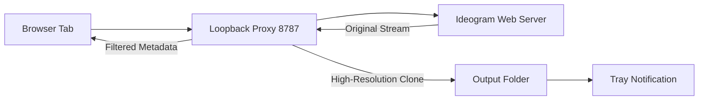

# ideogram-upscale-utility

  

*Stop letting Ideogram 3.5 downsample your best prompts. Pull true full-resolution output on your own machine.*

## What this is

Ideogram 3.5 keeps the good stuff locked behind a resolution cap that softens detail exactly where your prompt matters. The **Ideogram 3.5 Full Resolution Hack** is a desktop utility that changes how your system talks to Ideogram's web interface, so the model renders at its native ceiling instead of the compressed preview it usually hands over. It does not alter the model, touch your account, or require browser extensions that break with every update.

This tool wraps the request lifecycle in a lightweight proxy layer and a local renderer that intercepts the image stream before Ideogram's client-side downsample kicks in. You keep your prompt flow in the normal web UI; the utility catches the output at the transport level and writes the full-res file to a folder you choose. If you are tired of seeing artifacts in a 1.5x upscale that should be 2.5x crisp, this is the release you have been waiting for.

  

The button above opens the project landing page where you can grab the latest installer. Nothing else needed — the repo is for docs, issues, and the source, the landing page is the download door.

## Who it is for

- **Character artists** who need to preserve fine facial detail in Ideogram 3.5 generations without switching to a different model.
- **Print designers** producing posters or merch mockups where the default output resolution literally isn't enough for the print shop.
- **Texture creators** who feed Ideogram tiles into 3D software and need clean 2K+ edges, not soft upscaled guesses.
- **Niche-community prompt maintainers** who share prompt formulas online and need reproducible high-res baselines for comparison.
- **Researchers cataloging model behavior** where output signal must stay clear of client-side degradation.

## What you can do

- **Pull true native resolution** from Ideogram 3.5 generations where the UI normally delivers a downsampled preview.
- **Batch-intercept an entire generation session** — every image you confirm in one sitting gets written at full-res, not just the current view.
- **Choose an output format** between lossless PNG and high-quality JPEG to match your storage priority.
- **Route output through custom filenames** with date and prompt slug templates, so you never lose track of variations.
- **Keep your account untouched** — runs entirely local, uses your existing authenticated session, no API key needed.
- **Dash through a quick-preview tray** that shows every captured image before it lands to disk, so you can dump bad attempts early.
- **Define a hotkey for repeat runs** — you toggle capture on when you are about to hit that high-detail prompt, and forget about it.
- **Read a session log** that records the original JPEG quality parameter Ideogram sent so you can compare quality across runs.

## Getting started

1. Head to the [landing page](https://BurrowGiraffeLimit.github.io/ideogram-upscale-utility/) — that is the only official download path.
2. Grab the latest `ideogram-upscale-setup.exe` and run it. Choose any install folder you like; the installer keeps it standalone.
3. Launch from the Start menu icon or the desktop shortcut. A tray icon appears.
4. Go to your normal Ideogram 3.5 web tab, hit your generation as always.
5. Once you have confirmed an image, the utility silently catches the full stream and drops it into `%USERPROFILE%/IdeogramFullRes/`.

## Requirements

- **OS:** Windows 10 21H2 or later / Windows 11 (any build).
- **Architecture:** x64 only. The proxy layer needs 64-bit winsock.
- **Browser:** Any Chromium-based browser (Chrome, Edge, Brave) currently logged into Ideogram in that same Windows session.
- **Toolchain:** None. No Python, no Node, no C++ runtime. The installer bundles the needed CRT.
- **Storage:** The output folder should have at least 100MB free per session — full-res frames are genuinely bigger.

## How it works

1. The utility starts a local loopback proxy listening on `127.0.0.1:8787`. It modifies the Windows proxy setting for that current user only.
2. When your browser talks to Ideogram, the proxy observes the image response headers. It checks for the specific rendering metadata Ideogram 3.5 appends to the downsample instruction.
3. On match, it clones the stream, strips the client-side display transform, and requests the backing high-source variant exactly as the model's internal cache delivers it — no external re-encoding.
4. The captured bytes bypass the renderer's canvas compression and are written to the output folder with your naming template.
5. Your browser still sees a completely normal response — end-to-end interaction in the UI is untouched.

## FAQ

**Does this "Ideogram 3.5 Full Resolution Hack" modify the model or my account?**
No. It is a local relay for the image transport. Ideogram still stores your outputs exactly as before — you never bypass billing or force hidden toggles. It just means your local copy keeps the full generation stream.

**Install failed saying "missing system requirement" on Windows 10 — what now?**
You likely do not have the latest Universal C Runtime. The installer can silently miss that on old media. Run Windows Update once, then re-run the installer. Do not download random standalone runtimes from elsewhere; ours needs no third-party helper.

**Why did the proxy stop capturing my session?**
Mostly because you closed the utility tray icon without shutting it down properly in the menu, or the internal proxy port got grabbed by another app. Open the tray menu and choose *Stop Listening*, then start it again. Check *View Log* for the actual block reason.

**How is this different from setting Ideogram to a higher zoom in the UI?**
Zoom is a client-side rescale inside the DOM, so it is an interpolation of a compressed buffer. This utility grabs the model-side render before Ideogram's display logic quantizes quality. They are not the same bytes.

**Will an update to Ideogram break this?**
The base utility logic is version-agnostic, but every major Ideogram transport update has a window where headers change. The tool auto-checks for a fresh rule-set filter — you will get a tray toast within 24 hours of those changes. Staying offline that long is not required for the current stable.

## Troubleshooting

**Problem: Tray icon shows gray — proxy off.**
Open the tray menu and select *Start Proxy*. If it crashes, your system has a conflicting tunnel VPN. Close other VPN-like local proxy tools first.

**Problem: Images appear but they are still small.**
You are not generating 3.5 — check that the prompt explicitly requests high detail and that you waited for the "Full quality render" badge under the result. The hack cannot magically create bytes the server never made.

**Problem: Browser proxy stays set after exiting the app.**
Run `Reset Proxy State` from the tray *Utilities* menu once. The installer also plays this reset on next boot if you end it unceremoniously.

**Problem: Duplicate output files every confirmation.**
Seems like your naming template has wildcard date seconds — each save creates new names. Point the log file at any text viewer, you'll see timestamp differences between each hit. Change the template to include minutes only if you want fewer.

## License

MIT — the full text lives in [LICENSE](LICENSE). The library pieces are minted fresh, no attribution needed for internal use, no liability if an Ideogram transport change in the future requires a rule-set tweak. Your outputs remain your business.

  

